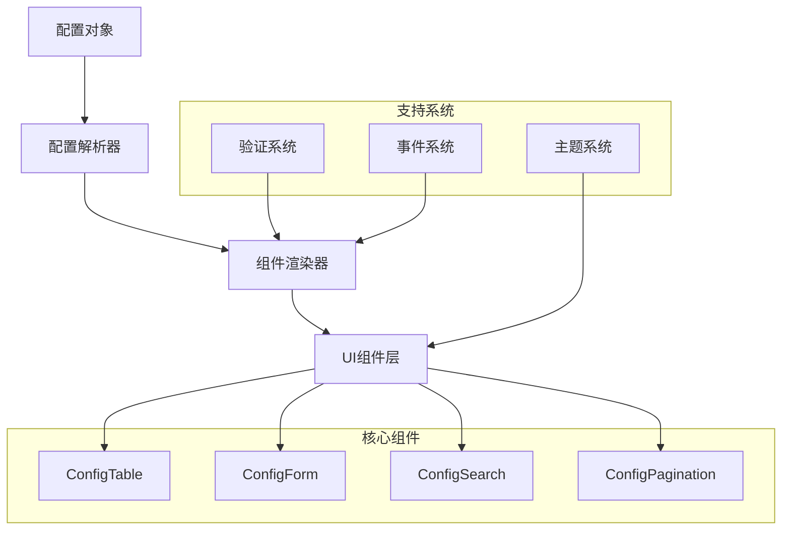

# Design Document

## Overview

本设计文档描述了一个类似 vben 的配置化表格和表单系统的架构设计。系统采用配置驱动的方式，通过 TypeScript 类型定义和配置对象来快速构建数据展示和操作界面。

核心设计理念：
- **配置驱动**：通过配置对象定义界面结构和行为
- **类型安全**：使用 TypeScript 提供完整的类型支持
- **组件化**：模块化设计，支持组件复用和扩展
- **主题化**：支持主题定制和样式配置

## Architecture

### 系统架构图



### 分层架构

1. **配置层**：定义表格、表单、搜索等组件的配置接口
2. **解析层**：解析配置对象，转换为组件可用的数据结构
3. **渲染层**：根据解析后的配置渲染对应的UI组件
4. **组件层**：具体的UI组件实现（基于Ant Design）
5. **支持层**：主题、验证等支持系统

## Components and Interfaces

### 核心配置接口

#### 表格配置接口

```typescript
// 列配置
interface ColumnConfig {
  key: string
  title: string | React.ReactNode
  dataIndex: string
  width?: number | string
  fixed?: 'left' | 'right'
  align?: 'left' | 'center' | 'right'
  sortable?: boolean
  filterable?: boolean
  searchable?: boolean
  resizable?: boolean
  
  // 数据类型和渲染
  type?: 'text' | 'number' | 'date' | 'datetime' | 'status' | 'image' | 'link' | 'custom'
  format?: string // 日期格式、数字格式等
  render?: (value: any, record: any, index: number) => React.ReactNode
  
  // 搜索配置
  search?: {
    type: 'input' | 'select' | 'date' | 'daterange' | 'numberrange' | 'custom'
    options?: Array<{ label: string; value: any }>
    placeholder?: string
    component?: React.ComponentType<any>
  }
  
  // 筛选配置
  filters?: Array<{ text: string; value: any }>
  filterMultiple?: boolean
  
  // 状态配置（用于status类型）
  statusMap?: Record<string | number, {
    text: string
    color: string
    variant?: 'default' | 'success' | 'warning' | 'error'
  }>
}

// 操作配置
interface ActionConfig {
  key: string
  title?: string
  width?: number
  fixed?: 'left' | 'right'
  actions: Array<{
    key: string
    label: string
    type?: 'primary' | 'default' | 'dashed' | 'link' | 'text'
    danger?: boolean
    icon?: React.ReactNode
    tooltip?: string
    visible?: (record: any) => boolean
    disabled?: (record: any) => boolean
    confirm?: {
      title: string
      content?: string
    }
    onClick: (record: any, index: number) => void | Promise<void>
  }>
}

// 表格配置
interface TableConfig {
  columns: ColumnConfig[]
  actions?: ActionConfig
  
  // 功能配置
  searchable?: boolean
  exportable?: boolean
  selectable?: boolean | 'single' | 'multiple'
  
  // 批量操作
  batchActions?: Array<{
    key: string
    label: string
    type?: 'primary' | 'default' | 'danger'
    icon?: React.ReactNode
    confirm?: boolean
    onClick: (selectedRows: any[], selectedKeys: string[]) => void | Promise<void>
  }>
  
  // 分页配置
  pagination?: {
    pageSize?: number
    pageSizeOptions?: number[]
    showSizeChanger?: boolean
    showQuickJumper?: boolean
    showTotal?: boolean | ((total: number, range: [number, number]) => string)
  }
  
  // 样式配置
  size?: 'small' | 'middle' | 'large'
  bordered?: boolean
  striped?: boolean
  
  // 滚动配置
  scroll?: {
    x?: number | string
    y?: number | string
  }
  
  // 工具栏配置
  toolbar?: {
    title?: string | React.ReactNode
    extra?: React.ReactNode
    actions?: Array<{
      key: string
      label: string
      type?: 'primary' | 'default'
      icon?: React.ReactNode
      onClick: () => void
    }>
  }
}
```

#### 表单配置接口

```typescript
// 字段配置
interface FieldConfig {
  key: string
  name: string | string[] // 支持嵌套字段
  label: string
  type: 'input' | 'password' | 'textarea' | 'number' | 'select' | 'multiselect' | 
        'radio' | 'checkbox' | 'switch' | 'date' | 'daterange' | 'time' | 
        'upload' | 'richtext' | 'custom'
  
  // 基础属性
  required?: boolean
  disabled?: boolean
  readonly?: boolean
  placeholder?: string
  tooltip?: string | React.ReactNode // 鼠标悬停提示
  help?: string | React.ReactNode // 字段下方帮助文字
  extra?: string | React.ReactNode // 额外的提示信息
  
  // 验证规则
  rules?: Array<{
    required?: boolean
    message?: string
    pattern?: RegExp
    min?: number
    max?: number
    validator?: (value: any, record: any) => Promise<void> | void
  }>
  
  // 选项配置（用于select、radio、checkbox等）
  options?: Array<{
    label: string
    value: any
    disabled?: boolean
  }> | (() => Promise<Array<{ label: string; value: any }>>)
  
  // 依赖配置
  dependencies?: string[] // 依赖的字段名
  visible?: (values: any) => boolean
  disabled?: (values: any) => boolean
  
  // 特定类型配置
  props?: Record<string, any> // 传递给具体组件的属性
  component?: React.ComponentType<any> // 自定义组件
  
  // 布局配置
  span?: number // 栅格占位格数
  offset?: number // 栅格左侧的间隔格数
}

// 表单配置
interface FormConfig {
  fields: FieldConfig[]
  
  // 布局配置
  layout?: 'horizontal' | 'vertical' | 'inline'
  labelCol?: { span: number; offset?: number }
  wrapperCol?: { span: number; offset?: number }
  
  // 功能配置
  initialValues?: Record<string, any>
  resetable?: boolean
  submitable?: boolean
  
  // 分组配置
  groups?: Array<{
    title: string
    key: string
    fields: string[]
    collapsible?: boolean
    defaultCollapsed?: boolean
  }>
  
  // 步骤配置（用于分步表单）
  steps?: Array<{
    title: string
    key: string
    fields: string[]
    description?: string
  }>
  
  // 事件回调
  onValuesChange?: (changedValues: any, allValues: any) => void
  onFinish?: (values: any) => void | Promise<void>
  onFinishFailed?: (errorInfo: any) => void
  
  // 样式配置
  size?: 'small' | 'middle' | 'large'
  disabled?: boolean
}
```

### 组件架构

#### ConfigTable 组件

```typescript
interface ConfigTableProps {
  config: TableConfig
  dataSource: any[]
  loading?: boolean
  rowKey?: string | ((record: any) => string)
  
  // 事件回调
  onSearch?: (filters: Record<string, any>) => void
  onPageChange?: (page: number, pageSize: number) => void
  onSelectionChange?: (selectedRowKeys: string[], selectedRows: any[]) => void
  onExport?: (type: 'excel' | 'csv' | 'pdf', data: any[]) => void
  
  // 样式配置
  className?: string
  style?: React.CSSProperties
}
```

#### ConfigForm 组件

```typescript
interface ConfigFormProps {
  config: FormConfig
  initialValues?: Record<string, any>
  
  // 事件回调
  onFinish?: (values: any) => void | Promise<void>
  onFinishFailed?: (errorInfo: any) => void
  onValuesChange?: (changedValues: any, allValues: any) => void
  
  // 样式配置
  className?: string
  style?: React.CSSProperties
}
```

#### ConfigSearch 组件

```typescript
interface ConfigSearchProps {
  config: {
    fields: Array<{
      key: string
      label: string
      type: 'input' | 'select' | 'date' | 'daterange' | 'numberrange'
      options?: Array<{ label: string; value: any }>
      placeholder?: string
    }>
    layout?: 'horizontal' | 'inline'
    collapsible?: boolean
    defaultCollapsed?: boolean
  }
  
  // 事件回调
  onSearch?: (values: Record<string, any>) => void
  onReset?: () => void
  
  // 样式配置
  className?: string
  style?: React.CSSProperties
}
```

## Data Models

### 配置数据模型

```typescript
// 主题配置
interface ThemeConfig {
  primaryColor: string
  borderRadius: number
  fontSize: {
    small: number
    default: number
    large: number
  }
  spacing: {
    small: number
    default: number
    large: number
  }
}


// 导出配置
interface ExportConfig {
  filename?: string
  sheetName?: string
  columns?: string[] // 指定导出的列
  format?: {
    date?: string
    number?: string
  }
}

// 验证结果
interface ValidationResult {
  valid: boolean
  errors: Array<{
    field: string
    message: string
    rule: string
  }>
}
```

### 状态管理模型

```typescript
// 表格状态
interface TableState {
  loading: boolean
  dataSource: any[]
  pagination: {
    current: number
    pageSize: number
    total: number
  }
  filters: Record<string, any>
  sorter: {
    field?: string
    order?: 'ascend' | 'descend'
  }
  selectedRowKeys: string[]
  selectedRows: any[]
}

// 表单状态
interface FormState {
  values: Record<string, any>
  errors: Record<string, string[]>
  touched: Record<string, boolean>
  submitting: boolean
  validating: boolean
}
```

## Error Handling

### 错误类型定义

```typescript
// 配置错误
class ConfigError extends Error {
  constructor(message: string, public field?: string) {
    super(message)
    this.name = 'ConfigError'
  }
}

// 验证错误
class ValidationError extends Error {
  constructor(message: string, public errors: ValidationResult['errors']) {
    super(message)
    this.name = 'ValidationError'
  }
}

// 渲染错误
class RenderError extends Error {
  constructor(message: string, public component?: string) {
    super(message)
    this.name = 'RenderError'
  }
}
```

### 错误处理策略

1. **配置验证**：在组件初始化时验证配置对象的完整性和正确性
2. **运行时错误**：使用 Error Boundary 捕获组件渲染错误
3. **异步错误**：统一处理异步操作（如数据加载、表单提交）的错误
4. **用户友好**：将技术错误转换为用户可理解的提示信息

### 错误边界组件

```typescript
interface ErrorBoundaryState {
  hasError: boolean
  error?: Error
  errorInfo?: React.ErrorInfo
}

class ConfigErrorBoundary extends React.Component<
  React.PropsWithChildren<{}>,
  ErrorBoundaryState
> {
  // 错误边界实现
}
```

## Testing Strategy

### 测试层次

1. **单元测试**
   - 配置解析器测试
   - 工具函数测试
   - 组件逻辑测试

2. **组件测试**
   - 组件渲染测试
   - 用户交互测试
   - 属性传递测试

3. **集成测试**
   - 组件间协作测试
   - 数据流测试
   - 事件传递测试

4. **端到端测试**
   - 完整功能流程测试
   - 用户场景测试
   - 性能测试

### 测试工具和框架

- **Jest**：单元测试框架
- **React Testing Library**：组件测试
- **MSW**：API模拟
- **Playwright**：端到端测试

### 测试配置示例

```typescript
// 测试用的配置对象
const mockTableConfig: TableConfig = {
  columns: [
    {
      key: 'name',
      title: '姓名',
      dataIndex: 'name',
      searchable: true,
      search: { type: 'input' }
    },
    {
      key: 'status',
      title: '状态',
      dataIndex: 'status',
      type: 'status',
      statusMap: {
        active: { text: '激活', color: 'green' },
        inactive: { text: '禁用', color: 'red' }
      }
    }
  ],
  actions: {
    key: 'actions',
    actions: [
      {
        key: 'edit',
        label: '编辑',
        onClick: jest.fn()
      }
    ]
  }
}
```

### 性能测试

1. **渲染性能**：测试大数据量下的组件渲染性能
2. **内存使用**：监控组件的内存占用情况
3. **交互响应**：测试用户交互的响应时间
4. **包大小**：监控打包后的文件大小

### 可访问性测试

1. **键盘导航**：确保所有功能都可以通过键盘操作
2. **屏幕阅读器**：测试与屏幕阅读器的兼容性
3. **颜色对比度**：确保颜色对比度符合WCAG标准
4. **焦点管理**：正确的焦点顺序和视觉反馈