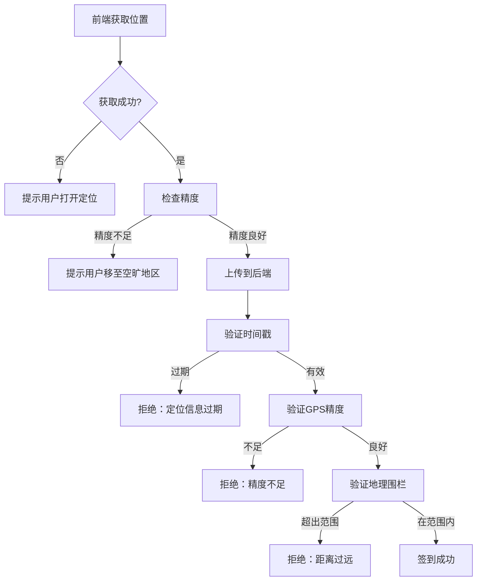

# 位置信息安全方案

## 📌 安全问题分析

### 存在的风险
1. **位置篡改**：用户可使用抓包工具修改位置信息
2. **模拟定位**：使用虚拟定位 APP 伪造位置
3. **历史位置重放**：重复使用旧的定位数据
4. **精度欺骗**：使用低精度定位数据

## ✅ 已实施的安全措施

### 1. 多维度位置验证

#### 后端验证（已实现）
- ✅ **经纬度坐标**：精确的 GPS 坐标
- ✅ **地理围栏**：验证是否在目标位置 500 米范围内
- ✅ **时间戳验证**：定位信息不能超过 5 分钟
- ✅ **GPS 精度验证**：要求精度误差在 100 米以内
- ✅ **定位来源**：记录定位方式（GPS/网络/混合）

#### 请求参数结构
```typescript
{
  signInPhoto: number,          // 签到照片 ID（必需）
  signInLocation: string,       // 位置描述（必需）
  latitude: number,             // 纬度（必需）
  longitude: number,            // 经度（必需）
  timestamp: number,            // 定位时间戳（必需）
  accuracy?: number,            // GPS 精度（可选）
  locationSource?: 'gps' | 'network' | 'hybrid'  // 定位来源（可选）
}
```

### 2. 地理围栏配置

| 参数 | 默认值 | 说明 |
|------|--------|------|
| maxDistance | 500 米 | 允许的最大签到距离 |
| maxAgeMinutes | 5 分钟 | 定位信息的最大时效 |
| maxAccuracy | 100 米 | GPS 精度要求 |

### 3. 验证流程



## 🔒 前端安全最佳实践

### 1. 获取高精度位置

```javascript
// React Native 示例（使用 react-native-geolocation）
import Geolocation from '@react-native-community/geolocation';

async function getCurrentLocation() {
  return new Promise((resolve, reject) => {
    Geolocation.getCurrentPosition(
      (position) => {
        const { latitude, longitude, accuracy, timestamp } = position.coords;
        
        // 检查精度
        if (accuracy > 100) {
          reject(new Error('GPS 精度不足，请在空旷地区重试'));
          return;
        }
        
        resolve({
          latitude,
          longitude,
          accuracy,
          timestamp: Date.now(), // 使用当前时间戳
          locationSource: 'gps'
        });
      },
      (error) => {
        reject(error);
      },
      {
        enableHighAccuracy: true,  // 启用高精度模式
        timeout: 20000,            // 20秒超时
        maximumAge: 0,             // 不使用缓存的位置
      }
    );
  });
}
```

### 2. H5/Web 应用示例

```javascript
async function getCurrentLocation() {
  if (!navigator.geolocation) {
    throw new Error('浏览器不支持定位功能');
  }

  return new Promise((resolve, reject) => {
    navigator.geolocation.getCurrentPosition(
      (position) => {
        const { latitude, longitude, accuracy } = position.coords;
        
        if (accuracy > 100) {
          reject(new Error('GPS 精度不足，请在空旷地区重试'));
          return;
        }

        resolve({
          latitude,
          longitude,
          accuracy,
          timestamp: Date.now(),
          locationSource: 'gps'
        });
      },
      (error) => {
        let message = '定位失败';
        switch (error.code) {
          case error.PERMISSION_DENIED:
            message = '用户拒绝了定位请求，请在设置中允许定位权限';
            break;
          case error.POSITION_UNAVAILABLE:
            message = '定位信息不可用，请检查GPS是否开启';
            break;
          case error.TIMEOUT:
            message = '定位请求超时，请重试';
            break;
        }
        reject(new Error(message));
      },
      {
        enableHighAccuracy: true,
        timeout: 20000,
        maximumAge: 0
      }
    );
  });
}
```

### 3. 签到流程示例

```javascript
async function handleSignIn(recordId, photoId) {
  try {
    // 1. 先获取位置
    const location = await getCurrentLocation();
    
    // 2. 使用反地理编码获取地址描述（可选）
    const address = await reverseGeocode(location.latitude, location.longitude);
    
    // 3. 提交签到请求
    const response = await fetch(`/api/mobile/care/record/${recordId}/signIn`, {
      method: 'POST',
      headers: {
        'Content-Type': 'application/json',
        'Authorization': `Bearer ${token}`
      },
      body: JSON.stringify({
        signInPhoto: photoId,
        signInLocation: address || '未知位置',
        latitude: location.latitude,
        longitude: location.longitude,
        accuracy: location.accuracy,
        timestamp: location.timestamp,
        locationSource: location.locationSource
      })
    });
    
    const result = await response.json();
    
    if (result.code === 200) {
      alert(result.data.message);
    } else {
      alert(`签到失败：${result.message}`);
    }
  } catch (error) {
    alert(`签到失败：${error.message}`);
  }
}

// 反地理编码示例（使用高德地图 API）
async function reverseGeocode(lat, lon) {
  try {
    const response = await fetch(
      `https://restapi.amap.com/v3/geocode/regeo?key=YOUR_KEY&location=${lon},${lat}`
    );
    const data = await response.json();
    return data.regeocode?.formatted_address || '未知位置';
  } catch (error) {
    console.error('反地理编码失败:', error);
    return '未知位置';
  }
}
```

## 🛡️ 进阶防护措施（可选）

### 1. 位置信息加密传输

虽然 HTTPS 已提供加密，但可以对敏感的位置数据进行额外加密：

```javascript
// 前端加密（使用 crypto-js）
import CryptoJS from 'crypto-js';

function encryptLocation(location, secretKey) {
  const data = JSON.stringify(location);
  return CryptoJS.AES.encrypt(data, secretKey).toString();
}

// 后端解密
import CryptoJS from 'crypto-js';

function decryptLocation(encrypted, secretKey) {
  const bytes = CryptoJS.AES.decrypt(encrypted, secretKey);
  return JSON.parse(bytes.toString(CryptoJS.enc.Utf8));
}
```

### 2. 设备指纹识别

记录设备信息，防止批量伪造：

```javascript
function getDeviceFingerprint() {
  return {
    userAgent: navigator.userAgent,
    platform: navigator.platform,
    language: navigator.language,
    screenResolution: `${screen.width}x${screen.height}`,
    timezone: Intl.DateTimeFormat().resolvedOptions().timeZone
  };
}
```

### 3. IP 地址辅助验证

后端可记录客户端 IP 地址，结合 IP 地理位置进行辅助验证：

```typescript
// 在 handler.ts 中获取客户端 IP
const clientIp = request.headers.get('x-forwarded-for') || 
                 request.headers.get('x-real-ip');
```

### 4. 行为分析

- 记录签到历史，分析异常模式
- 检测短时间内多次签到
- 检测异常的位置跳跃

## ⚙️ 配置建议

### 开发环境
```typescript
// 宽松的验证参数（便于测试）
{
  maxDistance: 5000,      // 5公里
  maxAgeMinutes: 30,      // 30分钟
  maxAccuracy: 500        // 500米
}
```

### 生产环境
```typescript
// 严格的验证参数
{
  maxDistance: 500,       // 500米
  maxAgeMinutes: 5,       // 5分钟
  maxAccuracy: 100        // 100米
}
```

### 可配置化（推荐）
将参数存储在数据库或配置文件中，支持动态调整：

```typescript
// 在数据库中存储机构级别的配置
interface OrganizationLocationConfig {
  maxDistance: number;
  maxAgeMinutes: number;
  maxAccuracy: number;
  enableStrictMode: boolean;
}
```

## 📊 监控和审计

### 1. 日志记录

```typescript
// 记录所有签到尝试
{
  userId: number,
  recordId: number,
  timestamp: Date,
  location: { lat: number, lon: number },
  distance: number,
  accuracy: number,
  result: 'success' | 'failed',
  reason?: string
}
```

### 2. 异常告警

- 连续签到失败超过 3 次
- 位置距离异常（超过 1000 米）
- 同一用户在不同地点快速签到

### 3. 数据统计

- 签到成功率
- 平均签到距离
- GPS 精度分布

## 🔧 故障排查

### 常见问题

1. **定位权限被拒绝**
   - 提示：引导用户到系统设置中开启定位权限

2. **GPS 信号弱**
   - 提示：建议用户移动到空旷区域重试

3. **定位超时**
   - 提示：检查网络连接，重新尝试

4. **距离验证失败**
   - 提示：确认是否在正确的服务地点
   - 管理员可临时调整允许范围

## 📝 总结

通过以上多层次的安全措施，可以有效防止位置信息篡改：

✅ **多维度验证**：经纬度 + 时间戳 + 精度 + 地理围栏  
✅ **实时验证**：后端验证，不完全信任前端  
✅ **合理的容错**：考虑 GPS 误差，设置合理的阈值  
✅ **用户体验**：清晰的错误提示，帮助用户解决问题  

虽然无法 100% 防止所有攻击，但可以大幅提高攻击成本和难度，满足大部分应用场景的安全需求。

